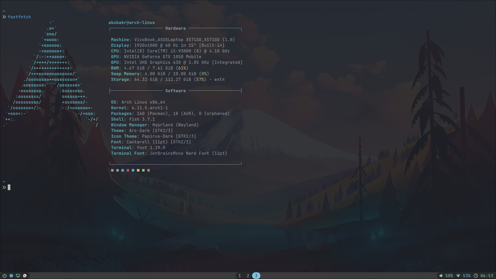
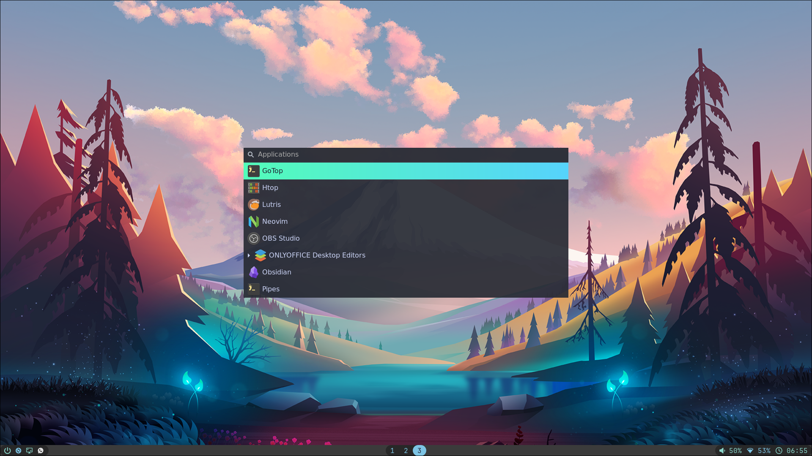
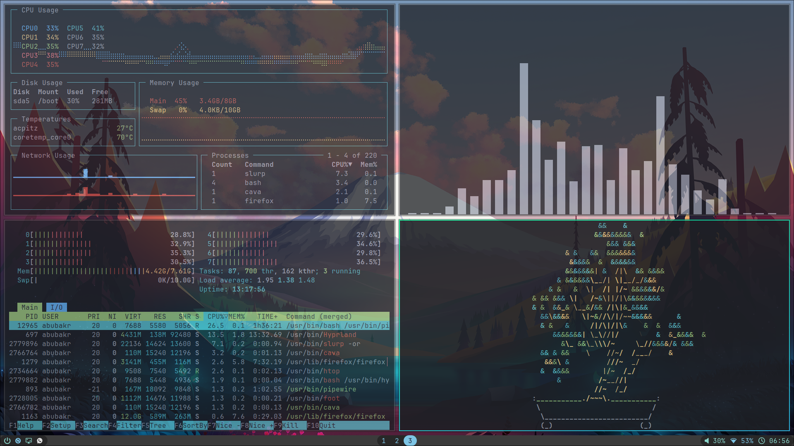

# Abubakr's Personal Dotfiles

## Screenshots







## Installation

Follow these initial setup instructions: \
[Initial Setup Instructions](.local/share/my_scripts/setup_scripts/initial_setup.md)

Then run this script, after logging into your Graphical Environment:
```bash
curl -o remaining_setup https://raw.githubusercontent.com/AbubakrBardien/dotfiles/main/.local/share/my_scripts/setup_scripts/remaining_setup_automation.sh
chmod +x remaining_setup
./remaining_setup
```
(Warning: the script hasn't been fully tested yet, but it should work) \
After rebooting, remove the script: `rm remaining_setup`

### Passwords

This script also downloads your Password Manager, located in this repo: \
[AbubakrBardien/password-manager](https://github.com/AbubakrBardien/password-manager)

So remember copy your password files (`My_Passwords.txt` and `Master_Password.txt`) to the correct locations for the Password Manager.

### Miscellaneous
You'll need to download the Helvetica font manually (at https://font.download/font/helvetica-255) and move the files into the `~/.local/share/fonts` directory.

## Programs I Use

WM/Compositor: [Hyprland](https://hyprland.org/)\
Terminal: [Foot](https://codeberg.org/dnkl/foot)\
Shell: [Zsh](https://wiki.archlinux.org/title/Zsh)

| Graphical | Terminal-Based | Theming |
| --------- | -------------- | ------- |
| Bar: [Waybar](https://github.com/Alexays/Waybar) | Editor: [Neovim](https://neovim.io/) | Wallpaper Setter: [Swww](https://github.com/LGFae/swww) |
| Luancher/Menu: [Wofi](https://github.com/SimplyCEO/wofi) | File Manager: [Yazi](https://github.com/sxyazi/yazi) | GTK Theme: [Arc Dark](https://github.com/jnsh/arc-theme) |
| Notification Tool: [Dunst](https://github.com/dunst-project/dunst) | System Info Tool: [Fastfetch](https://github.com/fastfetch-cli/fastfetch) | Icon Theme: [Papirus](https://github.com/PapirusDevelopmentTeam/papirus-icon-theme) |
| Browser: [Brave](https://brave.com/) | Task Manager for Linux: [HTop](https://github.com/htop-dev/htop)  | Login Theme: [Mountain](https://github.com/c0rydoras/sddm-mountain-theme) for [SDDM](https://github.com/sddm/sddm) |
| Video Player: [VLC](https://www.videolan.org/vlc/) | System Monitoring Dashboard: [GoTop](https://github.com/xxxserxxx/gotop) | Bootloader Theme: [Unnamed](https://www.pling.com/p/1482847/) for [Grub](https://wiki.archlinux.org/title/GRUB) |
| Image Viewer: [gThumb](https://gitlab.gnome.org/GNOME/gthumb) | Disk Space Display: [Duf](https://github.com/muesli/duf) | Lock Screen: [Hyprlock](https://github.com/hyprwm/hyprlock) (not configured yet) |
| Music Player: [Spotify](https://open.spotify.com/)| Disk Usage Analyzer: [Dust](https://github.com/bootandy/dust) ||
| Note-Taking App: [Obsidian](https://obsidian.md/) | | |
| PDF Viewer: [Zathura](https://wiki.archlinux.org/title/Zathura) | | |
| Video Recording: [OBS](https://obsproject.com/) | | |
| Cloud Service: [pCloud](https://www.pcloud.com/)| | |

### Fun Terminal Programs

[Cava](https://github.com/karlstav/cava) \
[CBonsai](https://gitlab.com/jallbrit/cbonsai) \
[CMatrix](https://github.com/abishekvashok/cmatrix) \
[Cowsay](https://github.com/cowsay-org/cowsay) \
[Figlet](https://github.com/cmatsuoka/figlet) \
[Pipes](https://github.com/pipeseroni/pipes.sh) \
[SL](https://github.com/mtoyoda/sl)
