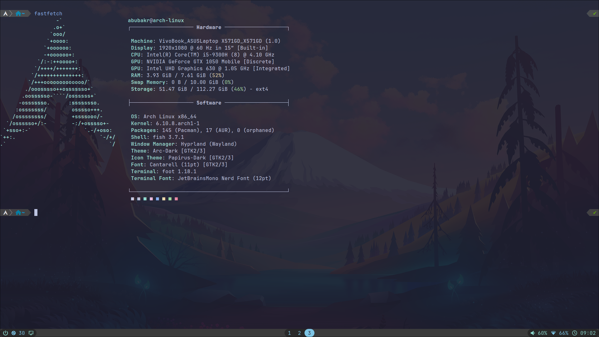
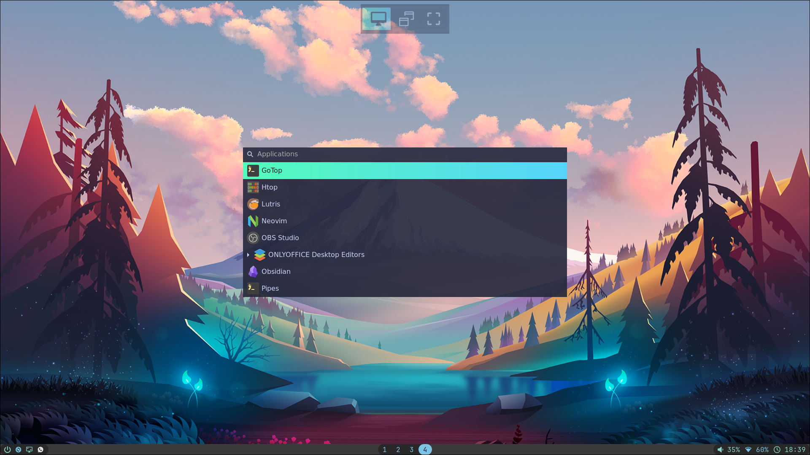
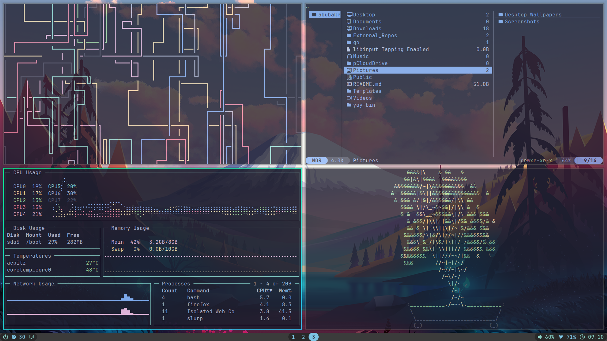

# Abubakr's Personal Dotfiles

## Screenshots







## Installation

Run 1st script when in the Arch Installation Medium:
```bash
curl -o setup1 https://raw.githubusercontent.com/AbubakrBardien/dotfiles/main/.local/share/my_scripts/setup_scripts/setup1.sh
chmod +x setup1
./setup1
```

Log into Hyprland. In the Hyprland config, change the default terminal to Foot. Run these commands in the Foot terminal:
```bash
curl -o setup2 -o pacman_packages.txt -o aur_packages.txt -o apps_to_hide.txt \
https://raw.githubusercontent.com/AbubakrBardien/dotfiles/main/.local/share/my_scripts/setup_scripts/{setup2.sh,{{pacman,aur}_packages,apps_to_hide}.txt}
chmod +x setup2
./setup2 <path_to_ssh_private_key>
```
(Warning: `setup2.sh` hasn't been fully tested yet)

## Programs I Use

WM/Compositor: [Hyprland](https://hyprland.org/)\
Terminal: [Foot](https://codeberg.org/dnkl/foot)\
Shell: [Fish](https://fishshell.com/) with the [Starship](https://starship.rs/) prompt.

| Graphical | Terminal-Based | Theming |
| --------- | -------------- | ------- |
| Bar: [Waybar](https://github.com/Alexays/Waybar) | Editor: [Neovim](https://neovim.io/) | Wallpaper Setter: [Swww](https://github.com/LGFae/swww) |
| Luancher/Menu: [Wofi](https://github.com/SimplyCEO/wofi) | File Manager: [Yazi](https://github.com/sxyazi/yazi) | GTK Theme: [Arc Dark](https://github.com/jnsh/arc-theme) |
| Notification Tool: [Dunst](https://github.com/dunst-project/dunst) | System Info Tool: [Fastfetch](https://github.com/fastfetch-cli/fastfetch) | Icon Theme: [Papirus](https://github.com/PapirusDevelopmentTeam/papirus-icon-theme) |
| Browser: [Firefox](https://www.mozilla.org/en-US/firefox/new/) | Task Manager for Linux: [HTop](https://github.com/htop-dev/htop)  | Login Theme: [Mountain](https://github.com/c0rydoras/sddm-mountain-theme) for [SDDM](https://github.com/sddm/sddm) |
| Video Player: [VLC](https://www.videolan.org/vlc/) | System Monitoring Dashboard: [GoTop](https://github.com/xxxserxxx/gotop) | Bootloader Theme: [Unnamed](https://www.pling.com/p/1482847/) for [Grub](https://wiki.archlinux.org/title/GRUB) |
| Image Viewer: [gThumb](https://gitlab.gnome.org/GNOME/gthumb) | Disk Space Display: [Duf](https://github.com/muesli/duf) | Lock Screen: [Hyprlock](https://github.com/hyprwm/hyprlock) (not configured yet) |
| Music Player: [Spotify](https://open.spotify.com/)| Disk Usage Analyzer: [Dust](https://github.com/bootandy/dust) ||
| Note-Taking App: [Obsidian](https://obsidian.md/) | | |
| PDF Viewer: [Zathura](https://wiki.archlinux.org/title/Zathura) | | |
| Video Recording: [OBS](https://obsproject.com/) | | |
| Cloud Service: [pCloud](https://www.pcloud.com/)| | |

### Fun Terminal Programs

[Cava](https://github.com/karlstav/cava) \
[CBonsai](https://gitlab.com/jallbrit/cbonsai) \
[CMatrix](https://github.com/abishekvashok/cmatrix) \
[Cowsay](https://github.com/cowsay-org/cowsay) \
[Figlet](https://github.com/cmatsuoka/figlet) \
[Pipes](https://github.com/pipeseroni/pipes.sh) \
[SL](https://github.com/mtoyoda/sl)
